# KAM Protocol - Institutions Flow Diagram

## Overview: Institution Journey

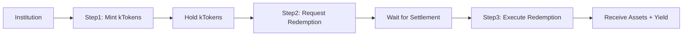

## Detailed Flow: Minting kTokens

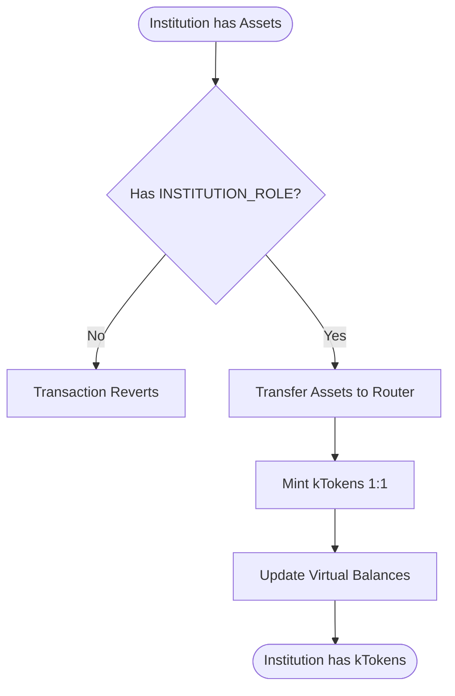

## Detailed Flow: Redemption Request

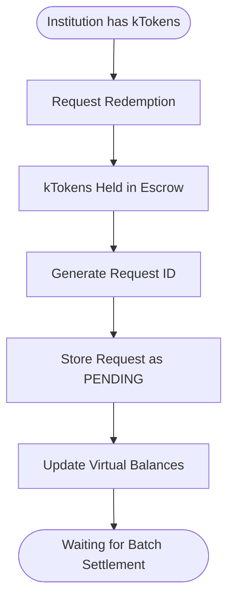

## Batch Settlement Process

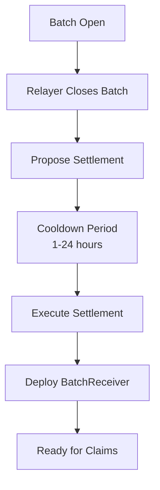

## Redemption Execution

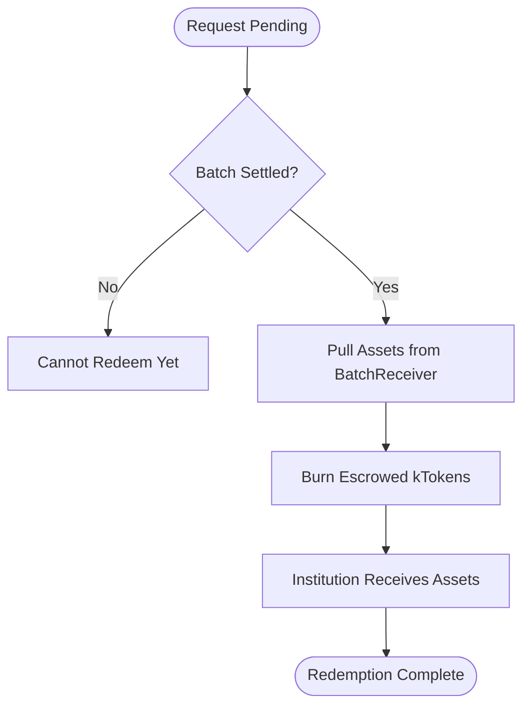

## Contract Architecture

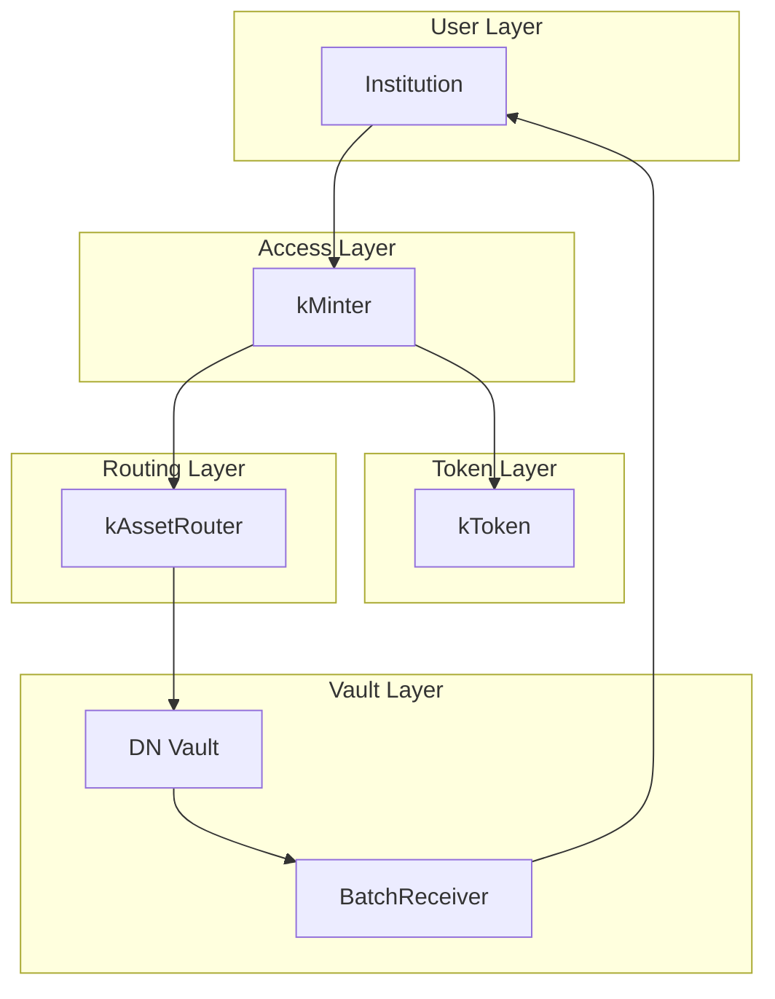

## State Machine: Request Lifecycle

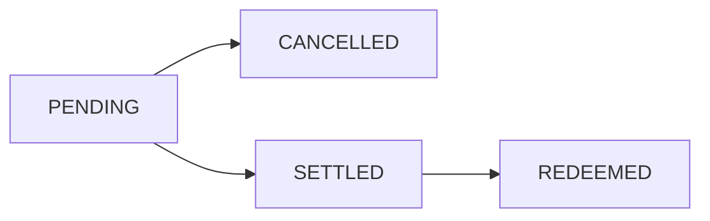

## Key Functions by Contract

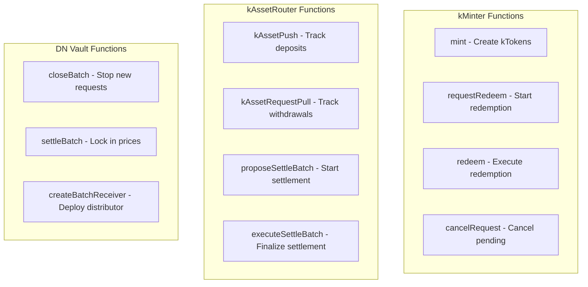

## Timeline: Happy Path

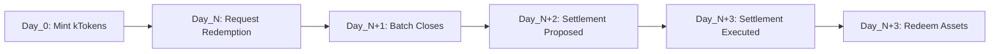

## Asset Flow

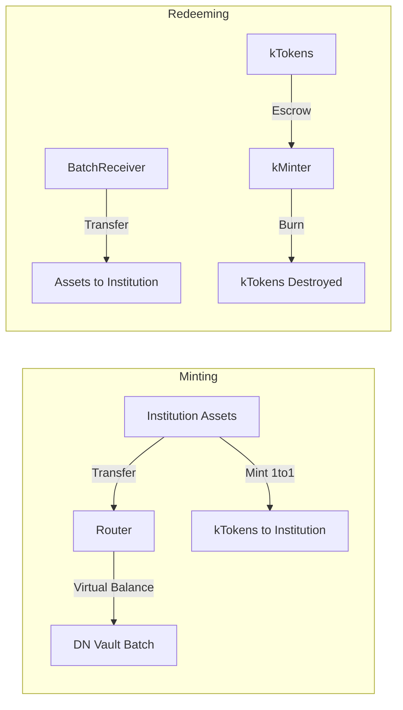

## Virtual Balance Tracking

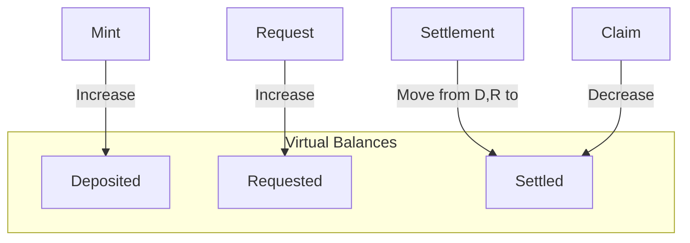
