# KAM Protocol - Users Flow Diagram

## Overview: User Journey

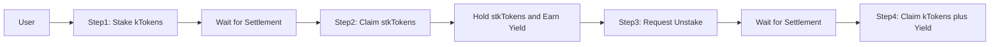

## Detailed Flow: Staking kTokens

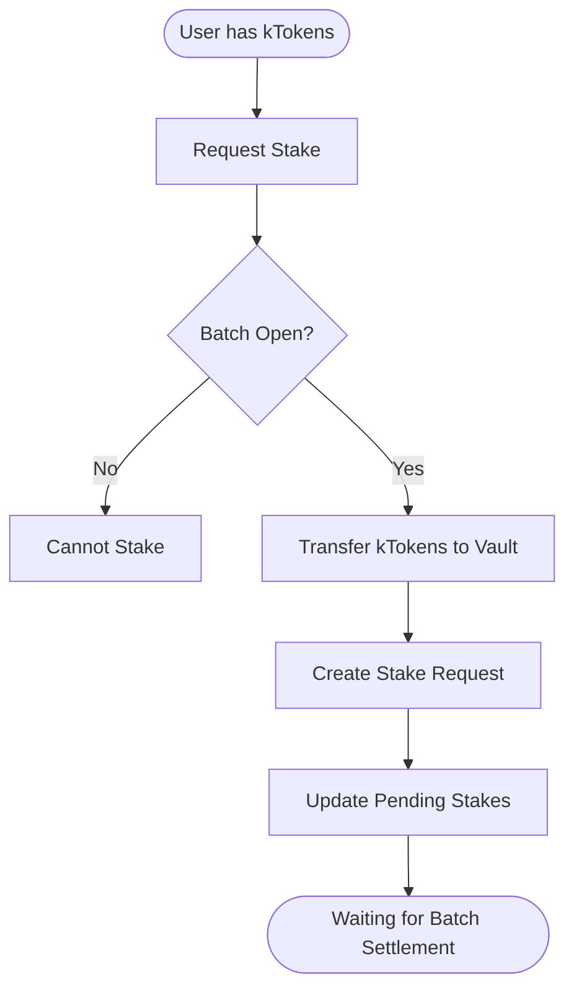

## Detailed Flow: Unstaking Process

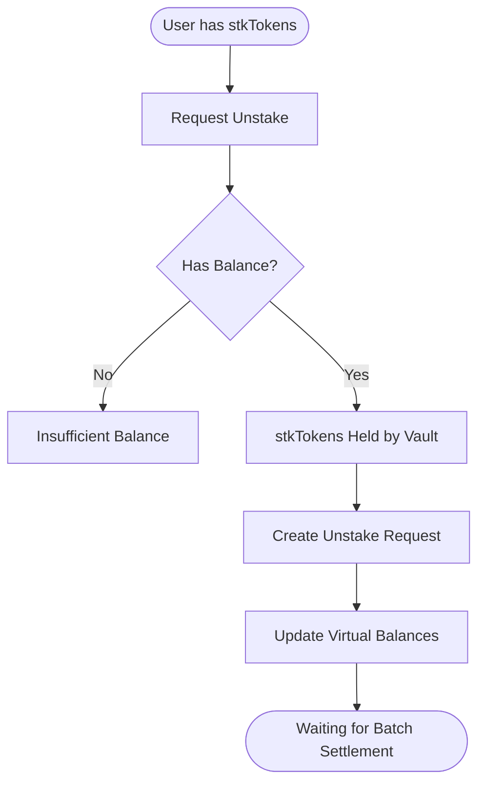

## Batch Processing

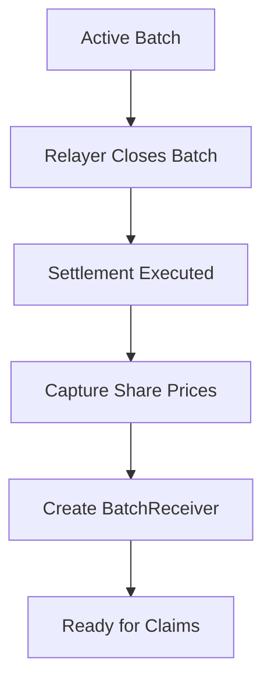

## Claiming Staked Shares

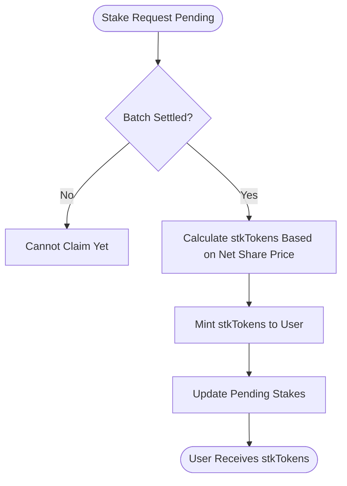

## Claiming Unstaked Assets

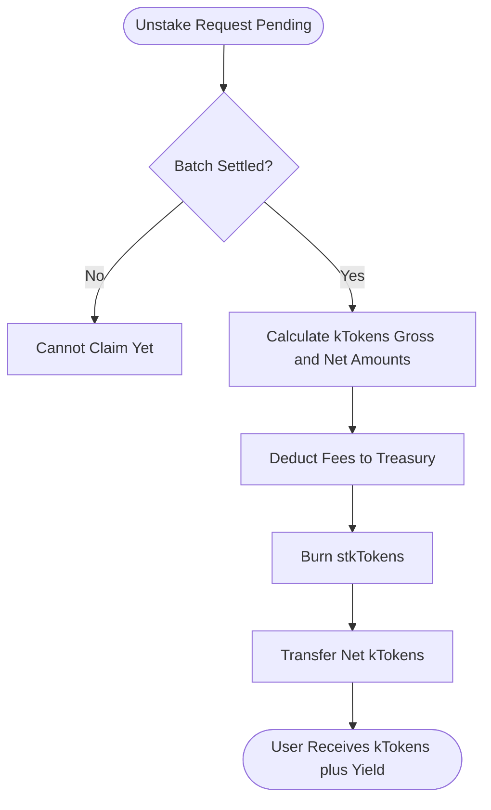

## Contract Architecture

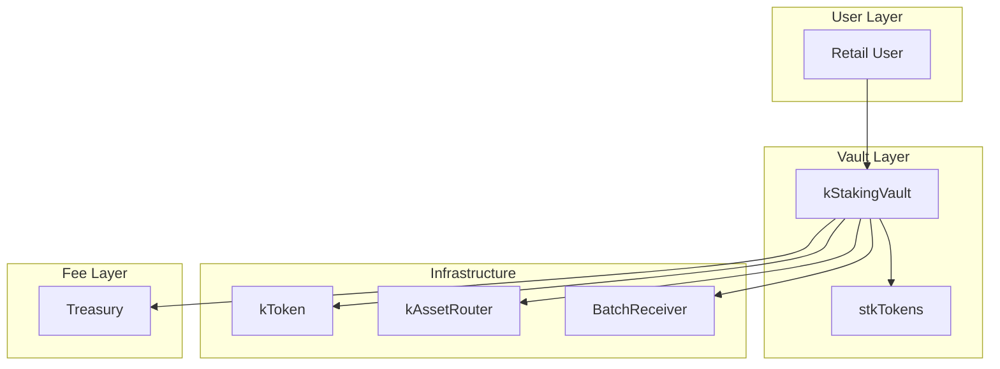

## Share Price Calculation

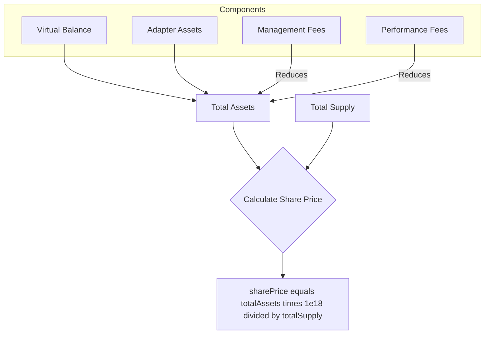

## Fee Distribution

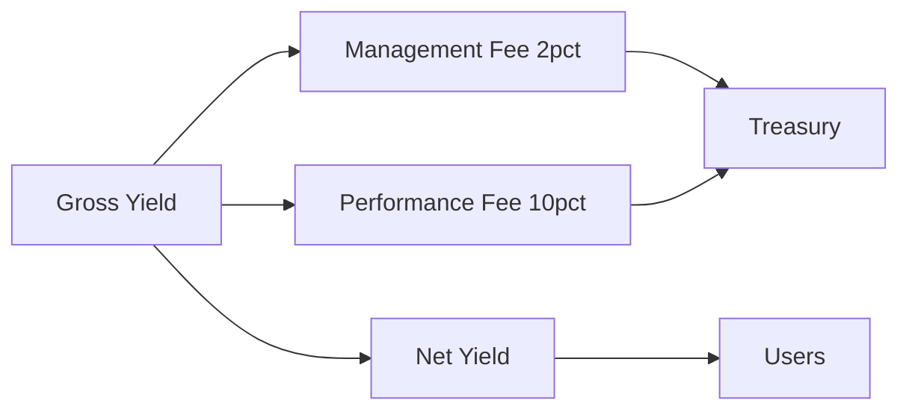

## Request States

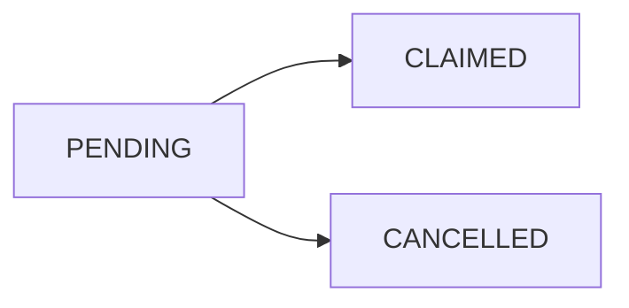

## Key Functions by Contract

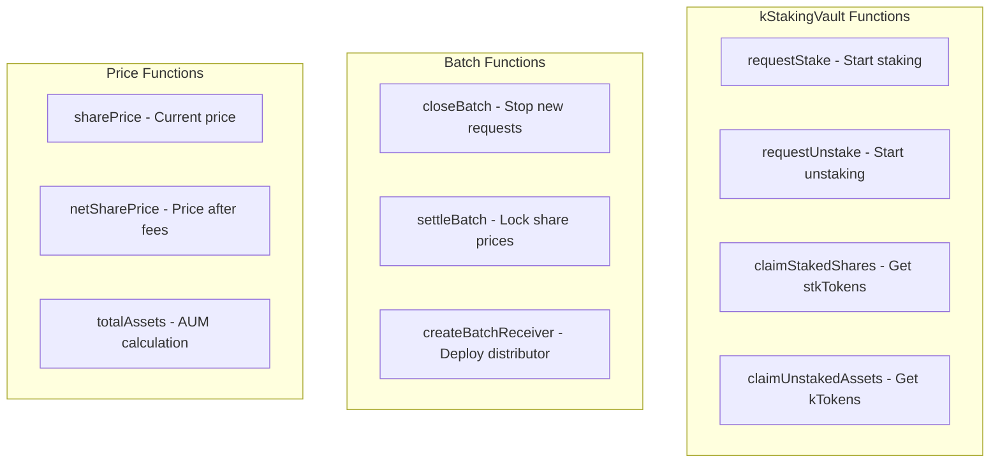

## Timeline: Happy Path Staking

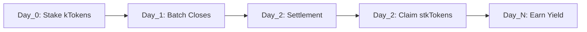

## Timeline: Happy Path Unstaking

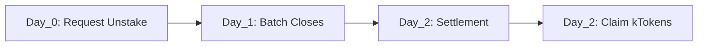

## Token Flow

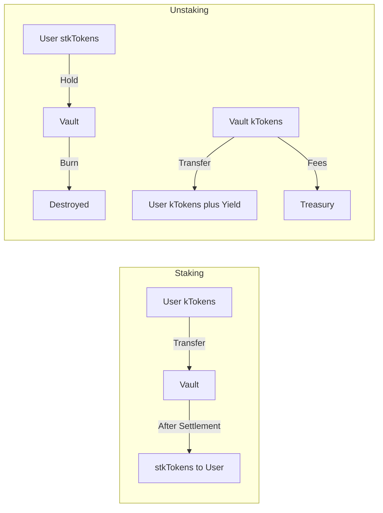

## Yield Accumulation

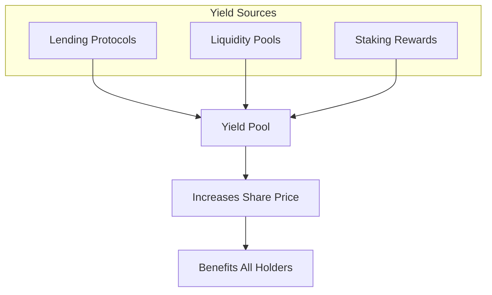